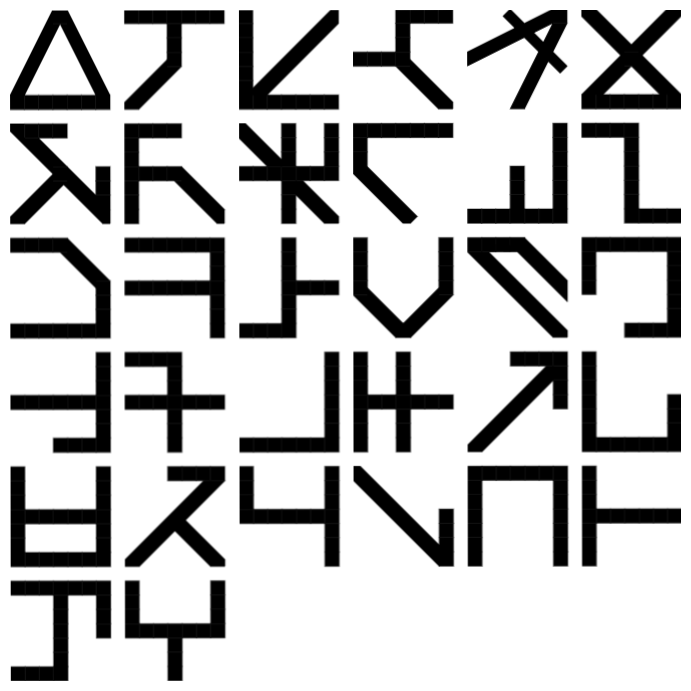

# marainkit

> **Work in progress.** An open specification and toolkit for **Marain**, the constructed language of Iain M. Banks' Culture novels. It's a reconstruction, not a claim to own or complete Banks' work.

*Marain glyphs rendered in TTFTCUTS' [Marain](https://fontstruct.com/fontstructions/show/1446008/marain-5) font.*

---

## What Marain is

Banks described Marain's writing system in a short companion essay, *A Few Notes on Marain* ([summary and archived copies](sources/a-few-notes-on-marain.md)). Each symbol is a **3×3 grid of binary cells**, which makes it a 9-bit number. That gives 512 possible symbols, #0 to #511. Banks fixes only a handful of facts:

- the number 1 is glyph **#1**, a single filled cell in the top-left corner (his Figure 1)
- the phoneme **/w/**, the first letter of the Marain alphabet, is glyph **#121**
- the principal letters are chosen so that none can be mistaken for another when rotated or mirrored. Rotated forms stand for related sounds.
- the remaining values cover numbers in **base 8**, punctuation, units, constants and chemical elements
- in data transmission each 9-bit symbol is followed by a **buffer bit**, and longer "bytes" (10, 12, 16 bits…) give bigger grids

The novels add that Marain has a single gender-neutral personal pronoun (*The Player of Games*) and that "nonary" Marain is "the three-by-three dot grid" every child learns (*Excession*). See [`sources/`](sources/).

That's close to the whole canon. Everything else in this repo is either a mathematical consequence of the grid or a decision this project made where Banks is silent, and the docs say which.

## What this repo contains

| Directory | What's in it |
|-----------|--------------|
| [`spec/`](spec/) | **The specification.** Grid and bit order, invariant glyphs, numerals, glyph table, the 16-bit packet, layout, rendering, display tokens, and the decision log. Start with [`spec/README.md`](spec/README.md). |
| [`language/`](language/) | Phoneme inventory, a 430-word community vocabulary, example sentences (data from [Marain Tools](https://marain-tools.netlify.app/)). |
| [`research/`](research/) | The reasoning behind the spec: linguistic relativity, Esperanto vs Hangul, Klingon, Sanskrit, CJK type design, reference fonts, prior art. |
| [`sources/`](sources/) | A summary of Banks' essay (with links to archived copies), his figures, and a curated list of novel references. |
| [`essays/`](essays/) | A four-part essay series written for a general audience. |
| [`docs/`](docs/) | The [interactive glyph table](https://marainkit.github.io/marain/) (GitHub Pages). |
| [`tools/`](tools/) | Scripts that generate the glyph table and PNGs, the font build, and a Claude Code skill. |
| [`themes/culture/`](themes/culture/) | The "Culture" design-token theme, brand assets, and Zed/Ableton theme ports. |

## Where things stand

| Area | Status |
|------|--------|
| Grid, bit order, 512-state space | Settled. Bit 0 is the top-left cell, per Banks' Figure 1. |
| 8 rotation/mirror-invariant glyphs | Settled as geometry. Their roles (warning/structural) are a project decision. |
| Base-8 numerals | Decided: sequential-fill digits #0, #1, #3, #7, #15, #31, #63, #127. |
| Phoneme → glyph values | **Open.** Two readings of Banks' alphabet figure disagree on 23 of 32 phonemes. Only /w/ = #121 is confirmed. See [`spec/glyph-index.md`](spec/glyph-index.md). |
| 16-bit packet (herald + rails + slate) | Structure decided; rail and herald meanings deliberately unassigned. |
| Grammar, tone, vocabulary | Open research. Community vocabulary only. |
| Display tokens (`themes/culture`) | Light theme done; dark, HUD and status escalation in progress. |

The full backlog is in [`spec/decisions.md`](spec/decisions.md).

## Where to start

- **New to Marain:** [`essays/01-engineered-defaults.md`](essays/01-engineered-defaults.md), then [Banks' essay](sources/a-few-notes-on-marain.md).
- **Want the spec:** [`spec/README.md`](spec/README.md) → [`spec/grid.md`](spec/grid.md) → [`spec/packet.md`](spec/packet.md).
- **Want the reasoning:** [`research/rationale.md`](research/rationale.md) and [`research/sapir-whorf.md`](research/sapir-whorf.md).
- **Contributing:** [`CONTRIBUTING.md`](CONTRIBUTING.md) covers how claims are labelled (canon vs inference vs project decision) and where things go.

## Prior art

| Project | Notes |
|---------|-------|
| [tomdionysus/marain-font](https://github.com/tomdionysus/marain-font) | Tom Cully's TrueType font of Banks' alphabet (2006). Sent to Banks via his publishers. |
| [zakalwe2040/marain](https://github.com/zakalwe2040/marain) | *Tonal Marain*: 24-consonant abjad, five tones, 4×5 lattice, numerals and operators. The most developed community extension. |
| [marain-tools.netlify.app](https://marain-tools.netlify.app/) | Romanised Marain ↔ glyphs ↔ binary, plus the community dictionary used in `language/`. |
| Reddit conlang (u/comradelenin456, u/ratioprosperous) | Synthetic grammar on Banks' alphabet: free word order, no tenses, six cases. |

More in [`research/prior-art.md`](research/prior-art.md).

## Credits and rights

- *A Few Notes on Marain* is © Iain M. Banks. This repo summarises it and links to [archived copies](sources/a-few-notes-on-marain.md#reading-the-essay) rather than reproducing it. His figures are included for study.
- Novel references are short quotations for commentary. Full-text extractions are kept out of the repo.
- Marain Regular font © bianc0niglio, CC BY-SA 3.0 (`docs/marain-regular/`). Tom Cully's Marain font (© 2006, all rights reserved) is **not** redistributed here; the glyph table loads it directly from [his repository](https://github.com/tomdionysus/marain-font).
- marainkit is a fan project with no affiliation to the Banks estate.
