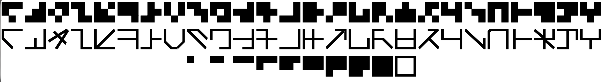
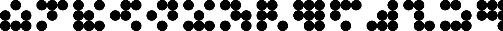
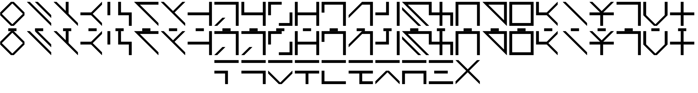
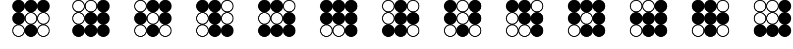
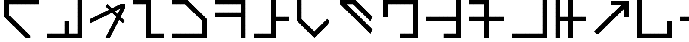
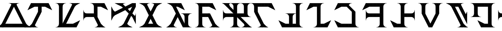
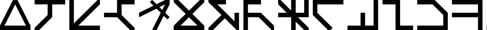
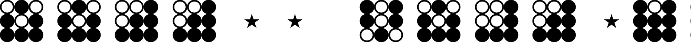
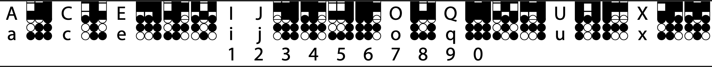

# Prior Art and Resources

Community reconstructions, tools and fonts for Marain, plus outside type references relevant to the display layer. For a value-by-value comparison with zakalwe2040, see [`../spec/prior-art-comparison.md`](../spec/prior-art-comparison.md).

---

## Primary source

- [*A Few Notes on Marain*](../sources/a-few-notes-on-marain.md), Banks' essay on the 3×3 binary system. Novel references are in [`../sources/novel-references.md`](../sources/novel-references.md).

## Reconstructions and tools

| Project | What it does |
|---------|--------------|
| [zakalwe2040/marain](https://github.com/zakalwe2040/marain), *Tonal Marain* | 24-consonant abjad, five tones, 4×5 lattice, numerals and operators as SVG diagrams. The most developed extension. |
| [Marain Tools](https://marain-tools.netlify.app/) | Romanised Marain → glyphs → 9-bit binary, plus an English ↔ Marain dictionary (source of [`../language/`](../language/)). |
| Reddit conlang (u/comradelenin456, u/ratioprosperous) | Synthetic grammar on Banks' alphabet: free word order, no tenses, six cases. |
| [DavidWeichselbaum/marain](https://github.com/DavidWeichselbaum/marain) | Encodes a whole sentence as one learnable glyph using a recurrent autoencoder (Python). Shares the name, not the system. |
| [New Marain Translator](https://lingojam.com/NewMarianTranslator(Updated)) | Swaps common English words for Marain ones within English text. |

## Marain fonts

Most are FontStruct builds. Check each licence before redistributing. Only Marain Regular (CC BY-SA 3.0) is included in this repo.

| Font | Author | Notes | Specimen |
|------|--------|-------|----------|
| [marain-font](https://github.com/tomdionysus/marain-font) / MarainBanks | Tom Cully (tomdionysus), 2006 | Implements Banks' phoneme alphabet. Sent to Banks via his publishers. © all rights reserved. Source of the "font reading". |  |
| [Marain](https://fontstruct.com/fontstructions/show/1446008/marain-5) | TTFTCUTS | Blocky standard form |  |
| [Marain Dots](https://fontstruct.com/fontstructors/1476779/ttftcuts) | TTFTCUTS | Monospace dot form close to Banks' figure |  |
| [Marain Regular](https://fonts2u.com/marain-regular.font) | bianc0niglio, 2010 | CC BY-SA 3.0. Draws some glyphs (e.g. /w/) mirrored relative to Banks. |  |
| [marain-11](https://fontstruct.com/fontstructions/show/2380807) | Anjoki01 | Dots, after Marain Dot Velh |  |
| [marain-2](https://fontstruct.com/fontstructions/show/2738804) | Anjoki01 | Thinner standard form |  |
| [Marain Serif](https://fontstruct.com/fontstructions/show/1562513/marain-serif-1) | comradelenin456 | Angular, Klingon-like |  |
| [Marain with punctuation and numerals](https://fontstruct.com/fontstructions/show/1508418/marain-with-punctuation-and-numerals) | conlanger56 | Blocky, good spacing |  |
| [Marain Dot Velh](https://fontstruct.com/fontstructions/show/2147046/marain-dot-velh) / [Marain-Velh](https://fontstruct.com/fontstructions/show/2147116/marain-velh) | Velh | Dot and block forms on Daniel Solis' keyboard layout |  |
| [Marain Ancient](https://danielsolisblog.blogspot.com/2010/12/free-font-marain-ancient.html), [Marain Script](https://danielsolisblog.blogspot.com/2010/09/free-font-marain-script.html), [2025 Marain font](https://www.patreon.com/posts/marain-font-134954490) | Daniel Solis | "Ancient alien" stroke styles |  |
| [tomcully.com/marain](https://web.archive.org/web/20070128013856/http://www.tomcully.com/marain.htm) | Tom Cully | Very early blocky version (archived) | — |

---

## Type references for the display layer

### Locked UI fonts

Atkinson Hyperlegible Next and Intel One Mono. Full analysis in [`reference-fonts.md`](reference-fonts.md).

### Typotheque CJK collection (2025)

[Typotheque's CJK collection](https://www.typotheque.com/blog/collection-of-new-original-cjk-fonts) took five years and won a Red Dot "Best of the Best" and a TDC award in 2023. Three variable CJK bases (TPTQ Sans, Serif and Round; ~50,000 characters each, SC/TC/JP/KR variants) plus Latin families with matched CJK and Hangul companions (Fedra, Greta, Lava, November, October, Ping, Zed). Specimens are in [`assets/cjk-specimens/`](assets/cjk-specimens/).

Why it's relevant: it's the same problem marainkit has, one glyph system serving several script traditions without privileging any of them. Particularly relevant are small-size disambiguation, script-agnostic layout, and the visual density of a square script next to Latin. See [`cjk-mixed-scripts.md`](cjk-mixed-scripts.md).
