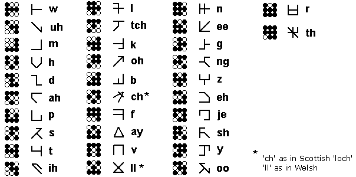
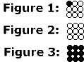
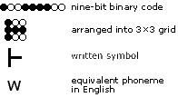

# A few notes on "A Few Notes on Marain"

"A Few Notes on Marain" is a short essay (about 800 words) in which Banks describes Marain's writing system. **This repo doesn't reproduce the text.** What follows is a summary in our own words, with very short quotations where the exact wording matters. Every `[canonical]` claim in the spec traces back to a point below.

**Date and venue:** unknown. Fan sites sometimes credit *Scripta Manent*, but nobody has confirmed it. Copies have circulated on fan and reference sites since at least 2002; the archived ones we know of are listed at the end.

---

## What the essay establishes

1. **Purpose.** Marain is a synthetic language created near the start of the Culture. It was meant to be culturally inclusive and as comprehensive as practical, appealing equally to poets, pedants, engineers and programmers. Its designers began from a "blank sheet", so it has no particular ties to the founding civilisations' own languages.
2. **The grid.** Every main symbol is a **three-by-three grid**, a picture of a nine-digit binary number. The grid was chosen so the language could be turned into binary as economically as possible. That gives **512 symbols, 0 to 511**.
3. **Two anchor values.** The number 1 is drawn as in Figure 1. The letter for /w/, the **first letter of the alphabet**, is binary `100111100`, which is **121**. (Read cell 0 first: see [`../spec/grid.md`](../spec/grid.md#bit-order).)
4. **Rotation.** Banks picked the principal letters so that none can be mistaken for another when rotated or mirrored. Rotated forms usually stand for sounds close to the original; some stand for unrelated sounds. The aim was to be able to write any language a humanoid can speak.
5. **The other values** are numbers in **base 8**, punctuation, common units, physical and mathematical symbols and constants, and chemical elements.
6. **Transmission.** In normal data transmission each symbol is followed by an extra **buffer bit**.
7. **Bigger "bytes".** A 10-bit byte adds 512 symbols. A **12-bit byte (4,096 symbols)** is the most common after the standard one, because it's easy to draw as a grid. A 4×4 grid gives 65,536. Larger grids carry pictograms, alien symbols and diagrams, and in principle even photographs.
8. **Obfuscation.** Banks notes, with humour, that the Minds play with the system: they drop buffer bits, change byte lengths without warning, and switch abruptly into alien codes such as Morse. The result is deliberate confusion.
9. **The alphabet figure** shows only the most commonly used forms. Banks notes there are plenty of other plausible ways to join up the dots.

## Figures

Banks' own figures © Iain M. Banks, kept for study and reference.

*The 32-letter alphabet, each 3×3 glyph next to a stroke form and its phoneme. Two readings of it disagree; see [`../spec/glyph-index.md`](../spec/glyph-index.md).*

*Figure 1: the number 1, with the top-left cell filled. Figures 2 and 3: #0 (empty) and #511 (full).*

*A translation example that accompanies the essay.*

---

## Reading the essay

Read it through the Internet Archive's Wayback Machine:

- **trevor-hopkins.com** (captured 16 Dec 2025): <https://web.archive.org/web/20251216194409/https://trevor-hopkins.com/banks/a-few-notes-on-marain.html>
- **Mostral**, a German fan site, online by 2002 (captured 24 May 2008): <https://web.archive.org/web/20080524200838/http://homepages.compuserve.de:80/Mostral/artikel/marain.html>
- **Language Maker**, Marain entry (captured 28 Feb 2008): <https://web.archive.org/web/20080228001042/http://www.langmaker.com/db/Marain>

To see every capture of a page, replace the timestamp with `*`, e.g. `https://web.archive.org/web/*/trevor-hopkins.com/banks/a-few-notes-on-marain.html`.

Discussion and catalogue entries: [The Culture Wiki](https://theculture.fandom.com/wiki/A_Few_Notes_on_Marain) · [Hacker News](https://news.ycombinator.com/item?id=18704377) · [LibraryThing](https://www.librarything.com/work/23096751/t/A-Few-Notes-on-Marain-%5Bessay%5D)
